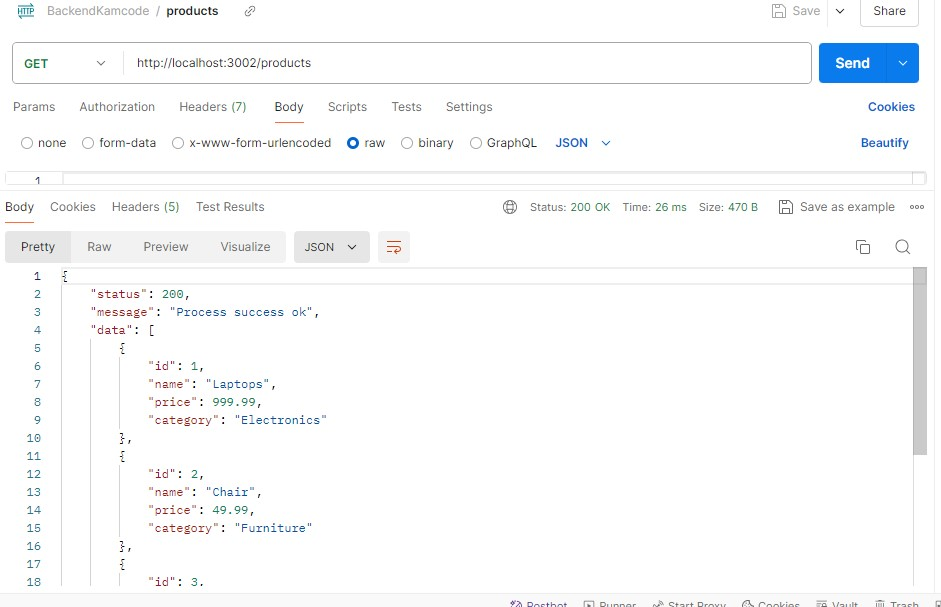
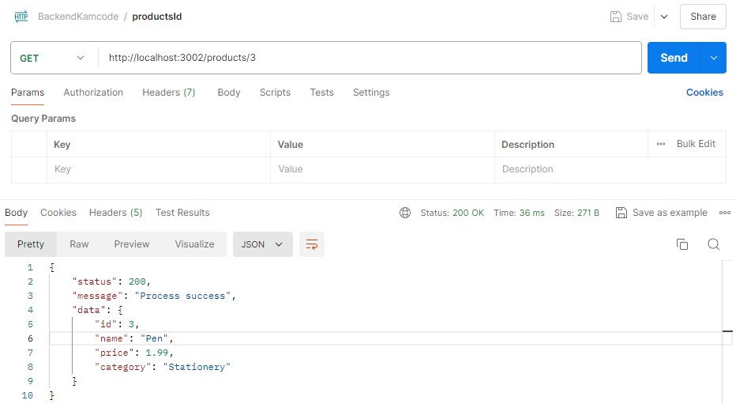

# API Products 

La API products, tiene 2 endpoints, GET/products(Todos los studiantes), Get products/id (Product idEstudiante con un id en especifico)

El consumo de la api se realiza desde un archivo JSON, llamado products.

## Configuración API

- Ruta: http://localhost
- Puerto: 3002
- Metodos: Get

### Metodo Get (All products)

- http://localhost:3002/products

### Metodo Get /id (products by id)

- http://localhost:3002/products/:id

