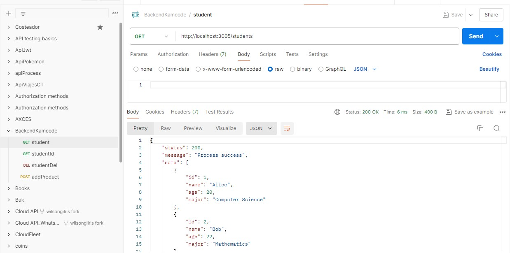
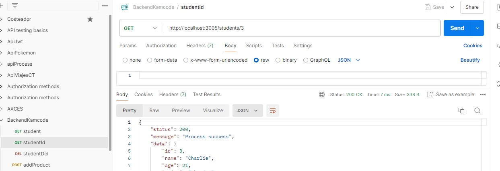
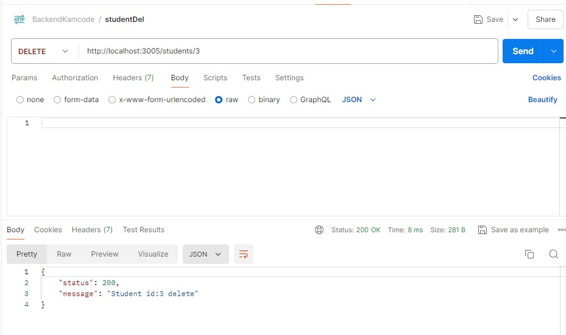

# API Students CON EXPRESS 

La API students, tiene 3 endpoints, Get(Todos los estudiantes), Get id(Estudiante con un id en especifico) y Delete para eliminar un registro por ID

El consumo de la api se realiza desde un archivo JSON, llamado students.

## Configuración API

- Ruta: http://localhost
- Puerto: 3005 
- Metodos: Get y delete

### Metodo Get (All students)

- http://localhost:3005/students

### Metodo Get /id (Student by id)

- http://localhost:3005/students/:id

### Metodo Delete (Del student by id)
- http://localhost:3005/students/:id

