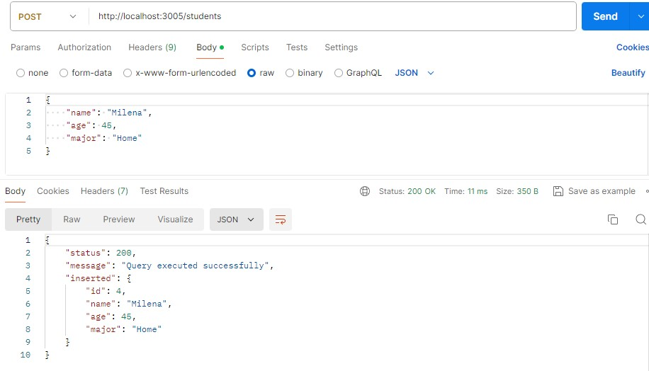
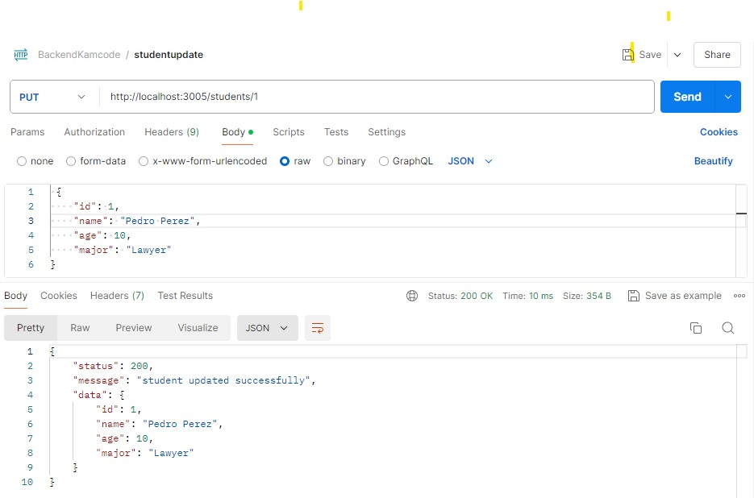

# API Students CON EXPRESS 

Continuando el desarrollo de a API students, se adicionan 2 endpoints, Post(Adicionar un estudiante), PUT id(Modificar Estudiante con un id en especifico, validando que exista.) Adiconal para cada uno de los endpoint se valida los datos a ingresar.

El consumo de la api se realiza desde un archivo JSON, llamado students.

## Configuración API

- Ruta: http://localhost
- Puerto: 3005 
- Metodos: Post y Get

### Metodo Post 

- http://localhost:3005/students

### Metodo PUT /id (Update Student by id)

- http://localhost:3005/students/:id

